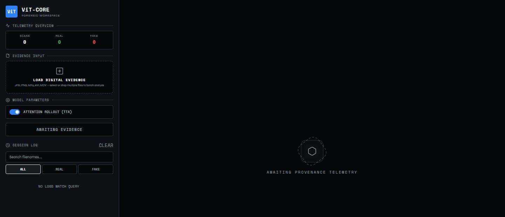
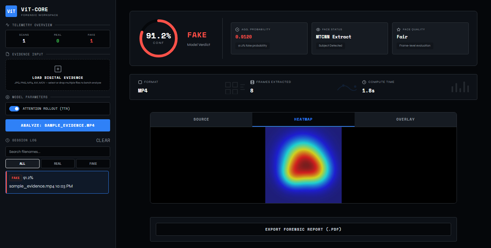
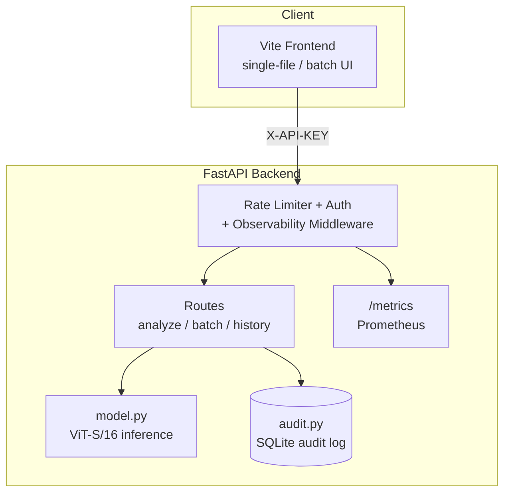

# ViT-CORE-FORENSICS

**A full-stack deepfake forensic analysis platform** built on a Dual-View Vision Transformer framework, delivering probabilistic, explainable assessments of media manipulation with forensic audit logging.

[](https://github.com/niiomar/VIT-CORE-FORENSICS/actions/workflows/ci.yml)
[](LICENSE)
[](https://www.python.org/)
[](https://nodejs.org/)


---

## Screenshots

| Workspace | Attention Rollout Heatmap |
|---|---|
|  |  |

> The heatmap screenshot renders the real frontend against illustrative demo data (not a live inference), so the UI shown is exactly what ships — just fed a controlled response for a clean capture. The workspace screenshot is the live app with no data involved.

---

## Table of Contents

- [Overview](#overview)
- [Architecture](#architecture)
- [Key Features](#key-features)
- [Project Structure](#project-structure)
- [Quick Start](#quick-start)
- [Configuration](#configuration)
- [Docker Deployment](#docker-deployment)
- [API Reference](#api-reference)
- [Model Card](#model-card)
- [Security & Deployment Notes](#security--deployment-notes)
- [Development](#development)
- [License](#license)

---

## Overview

ViT-CORE-FORENSICS is the production-deployment layer built on top of the [ViT-CORE](https://github.com/niiomar/ViT-CORE) training pipeline — an MSc Computer Science research project. It packages a Vision Transformer-based deepfake classifier into a full-stack forensic workspace: a FastAPI backend handling inference, attention-based explainability, audit logging, and rate limiting; and a Vite-built frontend providing an analyst-facing UI with session history and PDF report export.

The system is designed as a **screening aid for forensic analysts**. Outputs are probabilistic assessments, not definitive verdicts, and are intended to support — not replace — human investigation.

---

## Architecture

### Dual-View Vision Transformer Pipeline

The classifier departs from standard CNN-based detection by using a self-attention-driven dual-view consistency architecture:

1. **Parallel Augmentation** — Each input face is split into two independently augmented views (`RaAug` and `DFDC_Selim`-style augmentations).
2. **Shared Encoder** — Both views are tokenized into 16×16 patches and passed through a shared `ViT-S/16` transformer encoder.
3. **Feature Embedding** — The resulting representations (`f1`, `f2`) are L2-normalized into embedding vectors (`f̃1`, `f̃2`).
4. **Consistency Constraint** — A Mean Squared Error consistency loss (`L_cons`) aligns the two embeddings before they are passed to a shared classification head.

### Inference Pipeline


### Request Flow



---

## Key Features

- **Multi-Face Detection** — Every face in an image is detected and scored independently; a group photo gets one verdict per person instead of silently picking just one. Video aggregates only the primary face per frame (no cross-frame identity tracking), and flags when more than one subject is present so it isn't mistaken for a single-subject verdict.
- **Attention Rollout Heatmaps** — Native QKV hooks on the final transformer block reconstruct the self-attention matrix directly, bypassing PyTorch's fused SDPA path which breaks naive gradient-based hooks. Produces a spatial map of which facial regions drove the classification.
- **Conservative Frame Aggregation** — For video input, the reported face-quality metric is anchored to the *worst* quality observed across all sampled frames — a single blurry frame degrades the reported confidence for the whole clip.
- **Confidence-Weighted Logits** — Per-frame probabilities are aggregated with weights proportional to `|p - 0.5|`, so high-certainty frames dominate the final score and near-ambiguous frames are discounted.
- **Forensic Audit Log** — Every analysis is recorded in an append-only, WAL-mode SQLite log keyed by the SHA-256 hash of the input file, alongside verdict, confidence, model version, and timestamp — supporting "has this exact file been analysed before" lookups.
- **Batch Analysis** — `/api/v1/analyze/batch` accepts up to 50 files per request, processed with bounded concurrency, with per-file error isolation and a live batch-results UI.
- **Sliding-Window Rate Limiting** — Native request throttling protects inference compute from automated abuse.
- **Observability** — Request-ID log correlation, optional structured JSON logging, and a Prometheus `/metrics` endpoint (request counts, latency, batch size) with bounded label cardinality.
- **Checkpoint Integrity Verification** — The model checkpoint's SHA-256 is logged at startup and can be pinned via an env var, so a corrupted or tampered checkpoint fails loudly instead of producing silently-wrong verdicts.
- **PDF Report Export** — One-click forensic report generation (verdict, confidence, heatmap) via `jsPDF`.

---

## Project Structure

```
ViT-CORE-FORENSICS/
├── backend/
│   ├── main.py              # FastAPI app: routes, rate limiting, CORS, lifespan
│   ├── model.py             # PyTorch inference, MTCNN, TTA, attention rollout
│   ├── auth.py              # API key dependency (optional, env-gated)
│   ├── audit.py             # SQLite forensic audit log (WAL mode)
│   ├── ratelimit.py         # Sliding-window rate limiter
│   ├── observability.py     # Request IDs, structured logging, Prometheus metrics
│   ├── version.py           # Single source of truth for MODEL_VERSION
│   ├── export_audit_log.py  # Read-only audit log export (CSV/JSON), no server needed
│   ├── requirements.txt     # Python dependencies (NumPy < 2.0 locked)
│   ├── requirements-dev.txt # Test-only deps (pytest) — not needed at runtime
│   ├── .env.example         # Backend config template — copy to .env
│   ├── weights/             # Place vitcore_best.pth here (download from Releases)
│   ├── static/              # Vite build output — generated, not tracked in git
│   └── tests/
│       ├── test_smoke.py            # Inference-pipeline tests (model.py, direct calls)
│       ├── test_api.py              # HTTP-layer tests (main.py, via FastAPI TestClient)
│       └── test_export_audit_log.py # Audit log export tests
│
├── frontend/
│   ├── src/
│   │   ├── app.js           # Entry point — UI logic, fetch calls, state
│   │   ├── components/      # sidebar.js, workspace.js, history.js
│   │   ├── styles.css
│   │   └── utils/           # api.js, report.js (+ *.test.js — Vitest)
│   ├── index.html
│   ├── .env.example         # Frontend config template — copy to .env
│   ├── package.json
│   └── vite.config.js       # Build output → ../backend/static
│
├── docs/assets/               # README screenshots
├── .github/workflows/ci.yml   # Compile-check, tests, builds, dependency audits
├── .gitignore
├── CONTRIBUTING.md
├── Dockerfile                 # Multi-stage: Vite build → Python runtime
├── docker-compose.yml
├── MODEL_CARD.md              # Training data, benchmarks, known limitations
├── SECURITY.md
└── LICENSE
```

---

## Quick Start

### Prerequisites

- Python 3.10+
- Node.js 18+
- 8GB+ RAM (CUDA-enabled GPU recommended; CPU inference works but is slower)

### 1. Clone the repository

```bash
git clone https://github.com/niiomar/VIT-CORE-FORENSICS.git
cd VIT-CORE-FORENSICS
```

### 2. Set up the backend

```bash
cd backend
python -m venv venv

# Windows
venv\Scripts\activate
# macOS / Linux
source venv/bin/activate

pip install --upgrade pip
pip install -r requirements.txt
```

### 3. Download model weights

The trained checkpoint exceeds GitHub's file size limits and is distributed via Releases:

1. Go to the [Releases](https://github.com/niiomar/VIT-CORE-FORENSICS/releases) tab.
2. Download `vitcore_best.pth`.
3. Place it at `backend/weights/vitcore_best.pth`.

### 4. Configure environment variables

```bash
# from backend/
cp .env.example .env
# Edit .env — set MODEL_WEIGHTS_PATH=weights/vitcore_best.pth and API_KEY

# from frontend/
cd ../frontend
cp .env.example .env
# Set VITE_API_KEY to match backend/.env API_KEY
```

### 5. Build the frontend

```bash
# from frontend/
npm install
npm run build
```

This compiles the Vite project into `backend/static/`, which FastAPI serves directly.

### 6. Run the server

```bash
cd ../backend
uvicorn main:app --reload
```

Open **http://localhost:8000**.

---

## Configuration

All configuration is via environment variables loaded from `.env` files. These are never committed — see `.gitignore`.

### `backend/.env`

| Variable | Default | Description |
|---|---|---|
| `API_KEY` | *(unset)* | Shared secret for `X-API-KEY` header auth. If unset, the API is unauthenticated — acceptable for local use, not for any exposed deployment. |
| `CORS_ORIGINS` | `http://localhost:8000,http://127.0.0.1:8000` | Comma-separated allowed frontend origins. |
| `MODEL_WEIGHTS_PATH` | `vitcore_best.pth` | Path to the trained checkpoint, relative to `backend/`. |
| `MODEL_WEIGHTS_SHA256` | *(unset)* | Optional expected SHA-256 of the checkpoint. If set, the backend refuses to start on a mismatch. The actual hash is always logged at startup so you can capture and pin it. |
| `AUDIT_DB_PATH` | `audit_log.db` | Path to the SQLite audit log file. |
| `RATE_LIMIT_REQUESTS` | `20` | Max requests per client (by API key, or IP if unauthenticated) within the sliding window. Set to `0` to disable. |
| `RATE_LIMIT_WINDOW_SECONDS` | `60` | Sliding window size, in seconds, for rate limiting. |
| `BATCH_CONCURRENCY` | `4` | Max files from a `/api/v1/analyze/batch` request processed concurrently. Model inference itself is serialized internally; this bounds concurrent I/O (video decode, hashing). |
| `LOG_FORMAT` | `text` | `text` for human-readable console logs, or `json` for structured logs (with a `request_id` field) suitable for a log aggregator. |

### `frontend/.env`

| Variable | Description |
|---|---|
| `VITE_API_KEY` | Baked into the JS bundle at build time. Must match `API_KEY` in `backend/.env`. See [Security & Deployment Notes](#security--deployment-notes) for caveats. |

> ⚠️ Changes to `frontend/.env` only take effect after `npm run build`. The env vars are inlined at build time, not read at runtime.

---

## Docker Deployment

```bash
cp backend/.env.example backend/.env
cp frontend/.env.example frontend/.env
# Edit both files before building

docker compose up --build
```

This runs a multi-stage build (Vite → Python/FastAPI runtime) and serves the application on **http://localhost:8000**. Model weights and the audit database are mounted as volumes so they persist across container rebuilds. The image runs as a non-root user with a healthcheck against `/health`.

To enable GPU inference, uncomment the `deploy.resources` block in `docker-compose.yml` (requires the NVIDIA Container Toolkit).

---

## API Reference

All endpoints except `/health`, `/metrics`, and `/` require the `X-API-KEY` header when `API_KEY` is set.

### `POST /api/v1/analyze`

Analyze a single image or video file.

| Parameter | Type | Description |
|---|---|---|
| `file` | form-data, required | Image (`jpg`, `png`, `webp`, `bmp`) or video (`mp4`, `avi`, `mov`, `mkv`, `webm`). |
| `explain` | query bool, default `true` | Generate attention rollout heatmap. |

**Response:**

```json
{
  "verdict": "REAL",
  "confidence": 51.5,
  "probability": 0.485,
  "processing_time_sec": 0.4,
  "face_detected": true,
  "face_quality": "Poor",
  "type": "jpg",
  "frames_analyzed": 1,
  "is_low_confidence": true,
  "explainability_maps": ["<base64 JPEG>"],
  "filename": "evidence.jpg",
  "multiple_faces_detected": false,
  "file_sha256": "..."
}
```

`verdict`/`confidence`/`probability` always reflect the primary (largest)
face. If a single-image upload contains more than one face, the response
also includes a `faces` array with an independent verdict per face:

```json
"multiple_faces_detected": true,
"faces": [
  { "probability": 0.37, "verdict": "REAL", "confidence": 63.0, "face_quality": "Poor" },
  { "probability": 0.82, "verdict": "FAKE", "confidence": 82.0, "face_quality": "Fair" }
],
"disposition": "2 faces detected in this image — see 'faces' for independent per-face verdicts. ..."
```

For video, faces aren't tracked across frames (see
[Model Card](MODEL_CARD.md#known-limitations)), so multiple faces in a clip
only set `multiple_faces_detected` and a `disposition` note — there's no
per-face breakdown, to avoid implying a cross-frame identity match that
wasn't actually verified.

### `POST /api/v1/analyze/batch`

Analyze up to 50 files in one request, processed with bounded concurrency (`BATCH_CONCURRENCY`). `explain` defaults to `false`.

```json
{
  "summary": { "total": 12, "fake": 2, "real": 9, "errors": 1 },
  "results": [{ "..." }]
}
```

### `GET /api/v1/history?limit=50`

Returns the most recent audit log entries.

### `GET /api/v1/history/{file_sha256}`

Returns all past analyses for a specific file hash.

### `GET /health`

Readiness check — reflects whether the model actually loaded, not just
whether the process is up. Returns HTTP 200 with `{"status": "ok", "version": "2.1.0", "model_loaded": true, "device": "cpu", "weights_path": "...", "weights_found": true}`,
or HTTP 503 with `"status": "degraded"` if the model never loaded (e.g.
missing weights).

### `GET /metrics`

Prometheus scrape endpoint (request counts, latency histograms, batch size
distribution — labeled by route template, not raw resolved path, to keep
cardinality bounded). Unauthenticated, like `/health` — restrict network
access to it at the reverse-proxy/firewall level in any exposed deployment.

Every response also carries an `X-Request-ID` header (or echoes an inbound
one from a reverse proxy) for correlating a request with server-side logs.

---

## Model Card

Training data, benchmark results (FaceForensics++ / CelebDF / DFDC), and known limitations are documented in [`MODEL_CARD.md`](MODEL_CARD.md). **Read this before relying on model output for any decision-making context.**

---

## Security & Deployment Notes

- **The frontend API key is not a secret.** `VITE_API_KEY` is compiled into the publicly-served JS bundle and is visible to anyone who inspects the source. The `X-API-KEY` mechanism is a basic access gate suitable for internal or pilot deployments — it is not a substitute for proper access control.
- **Recommended production setup:** deploy behind a reverse proxy (Nginx, Caddy) with IP allowlisting or mutual TLS. Treat `API_KEY` as a secondary layer, not the primary security boundary.
- **CORS** is locked to explicit origins via `CORS_ORIGINS`. Do not set this to `*` in any deployment handling real evidence.
- **Audit log** (`audit_log.db`) records file hashes and filenames of all analysed media. Treat it as sensitive operational data — back it up and restrict access per your organization's evidence-handling policy. To export entries (for a compliance handoff, or to archive before a purge), see `backend/export_audit_log.py` below — this project deliberately does not implement automatic retention/purge/redaction, since that's an organizational policy decision, not something safe to guess at.
- Results are **probabilistic screening outputs only**. They should be treated as one input to a broader investigation, not as standalone conclusions.

### Exporting the audit log

```bash
cd backend
python export_audit_log.py --format csv --output export.csv
python export_audit_log.py --format json --since 2026-01-01 --until 2026-06-30
python export_audit_log.py --file-hash <sha256>          # all past analyses of one file
python export_audit_log.py --db /path/to/backup/audit_log.db  # run against a backup, no server needed
```

Read-only and operates directly on the SQLite file — no running server required, so it works equally well against a live `audit_log.db` or a backed-up copy.

---

## Development

### Running in development mode (two terminals)

**Terminal 1 — Backend:**
```bash
cd backend
source venv/bin/activate  # or venv\Scripts\activate on Windows
uvicorn main:app --reload
```

**Terminal 2 — Frontend (hot reload):**
```bash
cd frontend
npm run dev
```

Frontend runs on **http://localhost:5173** with API requests proxied to `http://127.0.0.1:8000`.

### Running as a single app (production mode)

```bash
# Step 1: build the frontend
cd frontend
npm run build

# Step 2: serve everything through FastAPI
cd ../backend
uvicorn main:app --reload
```

Open **http://localhost:8000**.

### Running tests

```bash
# Backend (inference-pipeline + HTTP-layer tests)
cd backend
pip install -r requirements-dev.txt
pytest tests/ -v

# Frontend
cd ../frontend
npm test
```

### CI

GitHub Actions (`.github/workflows/ci.yml`) runs on every push and pull request: backend compile-check, CPU tests (inference pipeline + HTTP layer) with untrained weights, frontend unit tests, a frontend production build, and informational `pip-audit`/`npm audit` dependency scans.

---

## Related Projects

- [ViT-CORE](https://github.com/niiomar/ViT-CORE) — the underlying training pipeline (dual-view architecture, augmentations, loss functions, evaluation) developed as part of an MSc Computer Science dissertation.

---

## License

Released under the [MIT License](LICENSE).
